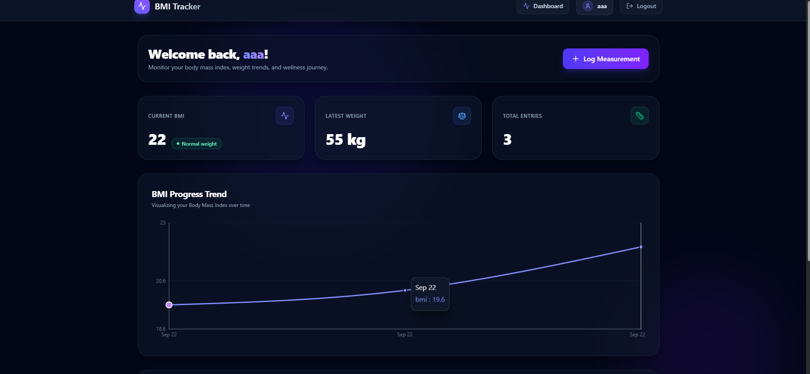
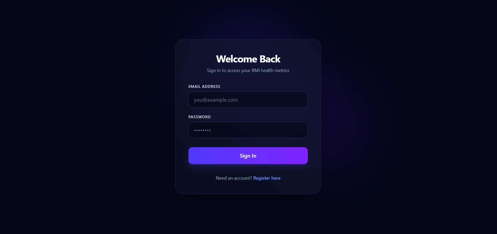
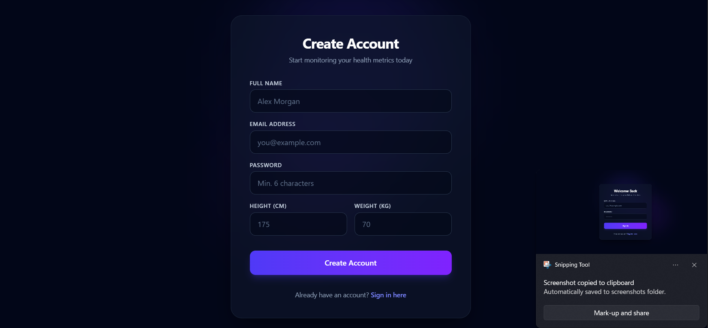

# 🏋️ BMI Tracker

A full-stack, production-ready Body Mass Index (BMI) tracking application built using the MERN stack (MongoDB, Express, React, Node.js). Features modern Dark Obsidian Glassmorphism design aesthetics, interactive Recharts visualization, TanStack Query state management, and secure JWT authentication with HttpOnly refresh token rotation.

---

## 🌐 Live Deployment Links

- 🚀 **Live Frontend Application**: [https://bmi-app-six-peach.vercel.app/](https://bmi-app-six-peach.vercel.app/)
- ⚡ **Live Express API (Backend)**: [https://bmi-app-backend-3ivo.onrender.com/](https://bmi-app-backend-3ivo.onrender.com/)
- 📦 **GitHub Repository**: [https://github.com/jayprakashm578/BMI-app](https://github.com/jayprakashm578/BMI-app)

---

## 🌟 Features

- **🎨 Premium Dark Obsidian UI**: Built with dynamic ambient glow effects, glassmorphism cards, modern typography, and smooth micro-interactions.
- **🔐 Secure JWT Authentication**: Implements access token authorization with HttpOnly cookie-based refresh token rotation and bcrypt password hashing.
- **⚡ Automatic Initial Log Generation**: Automatically calculates and records the user's first BMI measurement immediately upon registration.
- **📊 Interactive Progress Analytics**: Visualizes BMI progress trends over time using responsive Recharts line charts.
- **🏷️ Dynamic Health Categorization**: Real-time status badges (`Underweight`, `Normal weight`, `Overweight`, `Obese`) with animated status indicators.
- **📋 Measurement History Log**: View, filter, and delete past height/weight logs with instant cache invalidation via TanStack Query.
- **📱 Fully Responsive Layout**: Tailored for desktop, tablet, and mobile displays with dynamic breakpoint adjustments.

---

## 🛠️ Tech Stack

### **Frontend**
- **Framework**: [React 19](https://react.dev/) + [Vite](https://vitejs.dev/)
- **Styling**: [Tailwind CSS v4](https://tailwindcss.com/)
- **Data Fetching & Caching**: [TanStack Query v5](https://tanstack.com/query)
- **Data Visualization**: [Recharts](https://recharts.org/)
- **Icons**: [Lucide React](https://lucide.dev/)
- **HTTP Client**: [Axios](https://axios-http.com/)

### **Backend**
- **Runtime**: [Node.js](https://nodejs.org/)
- **Framework**: [Express.js](https://expressjs.com/)
- **Database**: [MongoDB](https://www.mongodb.com/) + [Mongoose ORM](https://mongoosejs.com/)
- **Authentication**: JSON Web Tokens (`jsonwebtoken`) + `bcryptjs`
- **Configuration**: `dotenv` + `cors` + `cookie-parser`

---

## 📐 Architecture

```
BMI App (Monorepo Workspace)
│
├── client/                     # Frontend Vite + React application
│   ├── src/
│   │   ├── api/                # Custom Axios instance with silent refresh interceptors
│   │   ├── components/         # Glassmorphism Navbar, Modals, Protected Routes
│   │   ├── context/            # AuthContext provider for global session management
│   │   ├── pages/              # Login, Register, and Dashboard views
│   │   ├── index.css           # Global CSS resets & Tailwind setup
│   │   └── App.jsx             # React Router configuration
│   └── package.json
│
└── server/                     # Backend Express REST API service
    ├── src/
    │   ├── config/             # Database connection setup
    │   ├── controllers/        # Request handlers (User, Measurement, Token Refresh)
    │   ├── middleware/         # Auth verification, registration validation, error handler
    │   ├── models/             # Mongoose Data Schemas (User, Measurement)
    │   ├── routes/             # Express API router endpoints
    │   ├── services/           # Database query services
    │   └── utils/              # Synchronous BMI calculator logic
    ├── app.js                  # Express application setup
    ├── server.js               # HTTP server entrypoint
    └── package.json
```

---

## 🔌 API Endpoints

### **Authentication & User Routes (`/api/user`)**
| Method | Endpoint | Access | Description |
| :--- | :--- | :--- | :--- |
| `POST` | `/api/user/register` | Public | Registers user and creates initial measurement log |
| `POST` | `/api/user/login` | Public | Authenticates credentials, sets HttpOnly refresh cookie & returns Access Token |
| `GET` | `/api/user/me` | Protected | Returns authenticated user profile |
| `POST` | `/api/user/logout` | Protected | Clears refresh cookie and revokes refresh token |
| `POST` | `/api/user/refresh` | Public | Issues a new Access Token using valid Refresh Token |

### **Measurement Routes (`/api/measurement`)**
| Method | Endpoint | Access | Description |
| :--- | :--- | :--- | :--- |
| `GET` | `/api/measurement` | Protected | Retrieves sorted measurement history for logged-in user |
| `POST` | `/api/measurement` | Protected | Logs a new height/weight measurement |
| `DELETE` | `/api/measurement/:id` | Protected | Deletes a measurement record by ID |

---

## 🗄️ Database Schema

### **User Collection (`users`)**
```javascript
{
  name: { type: String, required: true, trim: true },
  email: { type: String, required: true, unique: true, lowercase: true },
  password: { type: String, required: true, select: false },
  height: { type: Number, required: true },
  weight: { type: Number, required: true },
  refreshTokens: [{
    token: { type: String, required: true },
    createdAt: { type: Date, default: Date.now }
  }],
  createdAt: Date,
  updatedAt: Date
}
```

### **Measurement Collection (`measurements`)**
```javascript
{
  user: { type: Schema.Types.ObjectId, ref: "User", required: true },
  height: { type: Number, required: true },
  weight: { type: Number, required: true },
  bmi: { type: Number, required: true },
  category: { 
    type: String, 
    enum: ["Underweight", "Normal weight", "Overweight", "Obese"], 
    required: true 
  },
  createdAt: Date,
  updatedAt: Date
}
```

---

## 🖼️ Screenshots

### Dashboard Analytics


### Login & Auth


### Register


---

## 🚀 Local Setup & Installation

### **Prerequisites**
- [Node.js](https://nodejs.org/) (v18 or higher)
- [MongoDB](https://www.mongodb.com/) running locally on `mongodb://127.0.0.1:27017`

---

### **1. Clone Repository**
```bash
git clone https://github.com/jayprakashm578/BMI-app.git
cd "BMI app"
```

---

### **2. Server Configuration & Setup**
```bash
cd server
npm install
```

Create a `.env` file inside the `server/` directory:
```env
PORT=5000
NODE_ENV=development
MONGO_URI=mongodb://127.0.0.1:27017/bmi_db
JWT_ACCESS_TOKEN_SECRET=your_jwt_access_secret_key_here
JWT_REFRESH_TOKEN_SECRET=your_jwt_refresh_secret_key_here
```

Start the backend server:
```bash
npm run dev
```
*(Server will start on `http://localhost:5000`)*

---

### **3. Client Setup**
In a new terminal window:
```bash
cd client
npm install
npm run dev
```
*(Vite frontend will open on `http://localhost:5173`)*

---

## 📜 License

Distributed under the MIT License. See `LICENSE` for more information.
